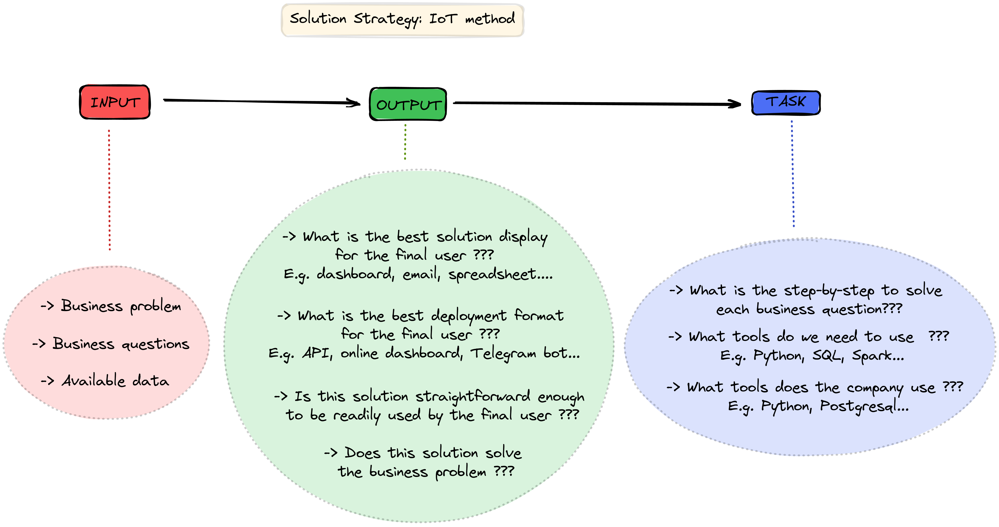
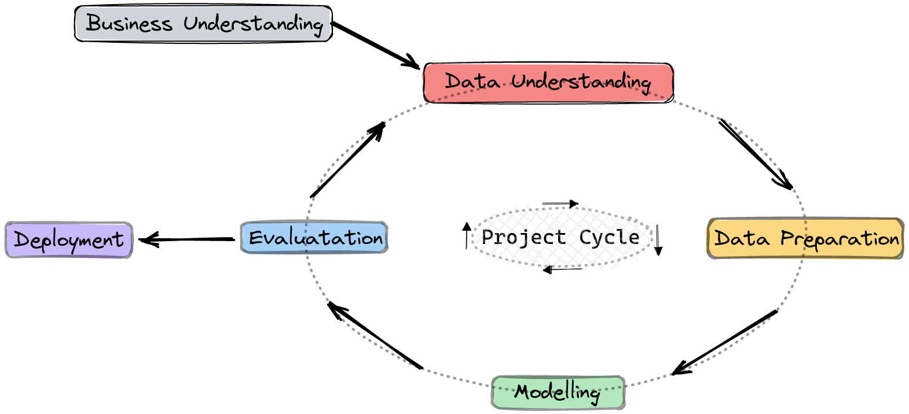

# **BUSINESS PROBLEM**

## **What is the company?**

Arapyaú

## **What is its business model?**

Arapyaú is a private, non-profit institution, founded in 2008 with the purpose of promoting dialogue and networking for the collective and permanent construction of solutions based on sustainability. Through the articulation and mobilization of different actors, we seek a sustainable development model in two main territories, the Amazon and southern Bahia, two biodiversity powerhouses.

## **What is the business problem the company is facing?**

Arapyaú wants to promote the sustainable economic development of municipalities in Legal Amazon in three main pillars: environmental, economic and social. In order to achieve this goal, Arapyaú launched a challenge, in partnership with BCG Gamma, to generate recommendations based on available public data in order to achieve this goal not only in an innovative but also more efficient way.

# **PROBLEM UNDERSTANDING**

## **What is the business solution that this project has to deliver?**

Based on available public data, generate recommendations with a focus on non-trivial insights and actionable recommendations to support the sustainable economic development of municipalities in the Legal Amazon.

# **BUSINESS ASSUMPTIONS FOR THIS CYCLE**

- If there was no data about fire warnings in some cities, it means that there was no forest fire in that city.

- In order to answer *"what regions have the highest social and economic return when recovering or reforesting deforested areas?"*, we will use the *"variation_percent_cobertura_florest_1985-2019"* variable as our target and try to understand its distribution and its behaviour in regard to other variables. This way *"variation_percent_cobertura_florest_1985-2019"* will be our proxy for *"recovering or reforesting deforested areas"*. Just remember that:
  -    *variation_percent_cobertura_florest_1985-2019 = (cobertura_florest_2019 - cobertura_florest_1985) / cobertura_florest_1985* 

# **SOLUTION STRATEGY**

*We split the topic into four (number of members in the group) so as to work in parallel. This notebook concerns:*
>> **What regions have the highest social and economic return when recovering or reforesting deforested areas?**

## **Input**

- **Business problem**: generate recommendations with a focus on non-trivial insights and actionable recommendations to support the sustainable economic development of municipalities in the Legal Amazon.

- **Business questions**: What regions have the highest social and economic return when recovering or reforesting deforested areas?

- **Available data**: public data with lots of CSVs and XLS files
- 
## **Output**

- Presentation with:
  - non-trivial insights and recommendations

- ML model (only if relevant to final purpose)

## **Tasks**

- What regions have the highest social and economic return when recovering or reforesting deforested areas?:
  - 1 - Understand what is the main goal
  - 2 - Define the scope of the solution (for this project cycle)
  - 3 - Define subjective terms in an objective (measurable) manner
  - 4 - Understand the data available (at a high level)
  - 5 - Load the data and merge required tables
  - 6 - Clean and prepare the data for analysis
  - 7 - Define hypotheses that will be tested on the present project cycle
  - 8 - Search for rows with misleading data (in regard to business understanding)
  - 9 - Explore the data to get insights
  - 10 - Check if it makes sense to create a ML model (if so, do the modelling steps)
  - 11 - Prepare the storytelling in regard to what is required for the final product

# **PROJECT CYCLE**

## Step 01. Business Problem

Understand what problem we are trying to solve and what is its business context. Besides, we try to understand what are the deliverables, what are the business questions to be answered and what are the main concerns of this problem.

## Step 02. Problem Understanding

Define the scope of the solution for the present project cycle and understand what seems to be the greatest challenges. Understand what data we have available and plan how to use data science tools to solve the business problem.

## Step 03. Imports

Set initial code configurations for the project, load python libraries and load the library made specifically for this project

## Step 04. Data Extraction

Understand the available data at a high level, load data from the available files and merge the required dataframes.

## Step 05. Data Description

Rename columns, check dataframe dimensions, check data types, and check missing values and duplicate rows. Then use statistics metrics to identify data outside the scope of business.

## Step 06. Feature Engineering

Create relevant variables for the EDA and/or data modelling.

## Step 07. Data Filtering

Filter rows and columns that do not contain relevant information or that do not match the scope of the business.

## Step 08. Exploratory Data Analysis

Inspect the relations between variables, explore data to find insights and validate the required hypotheses.

## Step 09. Deploy
Deploy the product of the present project cycle in the required format.

## Restart the cycle
Analyse feedback from the last project iteration and use it as a guide for improvements in the next project cycle.

# **Main findings and/or validations** [in plain portuguese]

- *Quase 95% dos municípios da Amazônia Legal reduziram sua coberta florestal entre 1985 e 2019.*
  - *Na média, essa redução em cobertura florestal for de **27% (~1/4)** de 1985 a 2019*.
- Quase 5% dos municípios da Amazônia Legal aumentaram a sua cobertura florestal entre 1985 e 2019.
  - Levando em consideração apenas esses municípios que aumentaram a sua cobertura florestal, a aumento médio no período foi de aproximadamente 6%, sendo que aproximadamente 50% dos municípios aumentaram a sua cobertura florestal em menos de 1% no período.

- Através dos dados, encontrou-se o seguinte:
  - Quanto maior a expectativa de anos de ensino, maior a redução na cobertura florestal. 
  - Quanto menor a parcela da população vulnerável a pobreza, maior a redução na cobertura florestal.
  - Quanto menor o ínidce de Gini (menos desigualdade), maior a redução na cobertura florestal. 
  - Quanto menor a diferença entre a renda dos mais ricos e dos mais pobres, maior a redução na cobertura florestal. 
  - Quanto maior a renda per capita, maior a redução na cobertura florestal. 
  - Quanto melhor a acesso a rede de água encanada, maior a redução na cobertura florestal. 
  - ***Quanto a esses achados acima, é importante fazer duas contatações***:
    1. O que se analisou foi a **correlação** entre duas variáveis e **não** a relação **causa-efeito** entre elas!
    2. Uma ***possível interpretação*** para esses achados é que as áreas mais "desenvolvidas" em termos econômicos e sociais tenderiam a ser áreas com mais desmatamento (e menor cobertura ambiental) como uma própria consequência das políticas adotadas para atingir esse maior desenvolvimento econômico e social (no Brasil, basicamente explorando recursos naturais existentes). Ou seja, se consegue ***melhores índices econômicos e sociais a custa (dentre outras coisas) de mais desmatamento***.

- Ao longo dos anos, a taxa de aumento da porcentagem de território dos estados destinado a fazendas é bem maior na Amazônia Legal que no restante do país.

- Ao longo dos anos, a taxa de diminuição da cobertura de florestas nos estados na Amazônia Legal é bem maior que no restante do país.

- Em relação ao restante do país, os estados da Amazônia Legal tem uma maior porcentagem do seu território que naturalmente não é coberto por florestas.

- Em relação ao restante do país, os estados da Amazônia Legal tem uma maior taxa de extensão de área de fazenda por área não coberta de vegetação que o restante do país. Isso quer dizer que, **pra cada hectar não coberto por vegetação, há mais hectares de fazenda na Amazônia Legal que no resto do país**.
  - Até meados da década de 90, a Amazônia Legal tinha esse percentual próximo dos outros estados, porém essa diferença vem se acentuando ao longo dos anos.

# **CONCLUSIONS**

Not all data science projects require modelling, this job application case is a clear example.

**Task prioritization** is a must when, due to each member's commitments, there is a shortage of available time to engage on a project.

# **LESSONS LEARNED**

**Task prioritization** and **time management** due to time restrictions that every member in the groups had due to their own commitments.

How to do a data science project where the deliverable is not a model to make some predictions.

How to plan the project presentation to make the project accessible to others.

# **NEXT STEPS TO IMPROVE**

**Exploaroty Data Analysis**: raise hypotheses to validate and explore the relationship between variables deeper.

**Business Understanding**: collect feedback from the last project cycle and use it to improve business understanding. Revise the planned solution for this project (according to the IoT method) and update it according to feedback.

**Database**: research for a better description of every column in the database to further understand (and use) available data.

**Feature Engineering**: explore feature creating to find out new relevant features (and metrics) for the project solution.

**Storytelling**: get feedback for the first presentation and use it to improve the storytelling template for the next cycle.